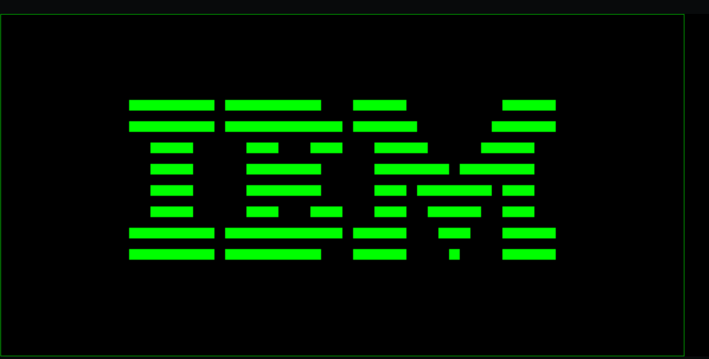
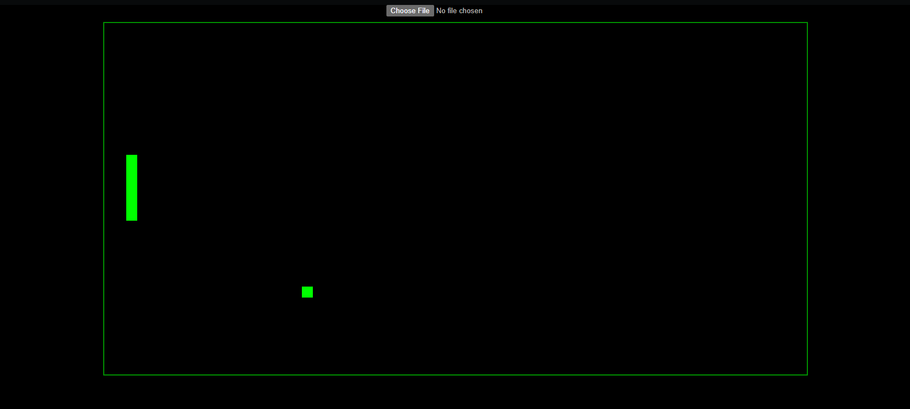

# CHIP-8 (JavaScript)
Chip-8 is a Interpreted programming language made by Joseph Weisbecker (1977) made to write video games on old 8-bit computers easier 
This version of Chip-8 is written JS as it way easier than to write it in C or Python 

## Status
- Completed

## How Does it Work?
> ```text
> ├── index.html    # Entry point, canvas element, script loading
> ├── cpu.js        # Chip8 class: memory, registers, fetch-decode-execute
> loop
> ├── display.js    # Display class: Canvas 2D rendering
> ├── input.js      # Input class: keyboard → CHIP-8 hex keypad mapping
> ├── index.js      # Wires everything together, requestAnimationFrame loop
> └── roms/
>      ├── ibm-logo.ch8       # IBM logo test ROM
>      ├── test_opcode.ch8    # corax89 general opcode test
>      ├── 6-keypad.ch8       # Timendus keypad/input test
>      ├── 4-flags.ch8        # Timendus ALU flag correctness test
>      └── Pong.ch8           # Default game (really fun try it out 2 player compatible)
> ```

> ```text
> ├── cpu.js        # Brain: Owns CHIP-8 machine state: 4KB RAM, 64x2 buffer, keys array (The intelligence of the Chip-8)
> ├── display.js    # renderer: Takes display buffer and draws to HTML5 via 2D context (Creates the Output)
> ├── input.js      # Keypad mapper: Maps QWERTY to CHIP-8 hex keypad, updates cpu.js keys array ( Takes input )
> └── index.js      # Main entry: instantiates components, fetches ROM, runs requestAnimationFrame loop ( The scheduler )
> ```





## What has been done so far?

- Core Hardware ( CPU, Memory, Registers etc ) 
- ROM loading 
- All Opcodes implemented 
- drawsprite() - Sprite reading from memory
- Canvas Redering pipeline ( testeed against the IBM logo test )
- Keyboard input ( not being used currently but exsists )
- You can play games now ( yayyyy, dosent mean you can play minecraft on your browser T-T )
- It output sound now like the old retro video games
- You can also load you own .ch8 games and play on it 

## Future Updates

- A better UI with a unidentified ROM rejection system? (Maybe ill do it)
## Testing Done

- IBM logo
- corax89 
- Timendus ( flag test )
- Working pong

## BugFixes

- Fixed LoadROM and drawSprite defined outside class body causing ';' expected error
- Reference Error caused by 'A' in Unit8Array to be replaced by 'a'
- Wrong bit shifter for x- (opcode && 0x0f00) >> 12 shouldve been >> 8 causing wrong reading of register
- Reused undefined variable (sum) across switch cases - copy-paste from the 8XY4 case left reference to sum in the 8XY5 case which didnt exsist
- Removed this.pc +=2 from default ehich cause only unknown opcodes advanced the program counter, while every real opcode either returned early or silently failed to advance.
- Bug i hate personally - fillstyle vs fillStyle: Canvas API's real property is fillStyle (capital S); the lowercase version silently creates an unused property instead of throwing an error, so every fillRect() call quietly drew in the default black instead of green, with zero console errors to point at the cause. Found via manually wrapping fillRect to log its real arguments and diffing against a known-working manual test. (only took me an entire hour of brain scratching)
- Infinite loop in FX65 — for (let i = 0; 1 <= x; i++) instead of i <= x. Since the loop condition never referenced the loop variable, it ran forever and froze the browser tab on the very first cycle that hit this opcode.
- this.key vs this.keys in input.js — a missing s on the keyup listener meant releasing a key threw Cannot set properties of undefined, since this.key (singular) was never defined anywhere. thankfully i learned from last time and fixed this bug quite fast 
- Missing 8XYE (shift left) case entirely — the ALU switch handled 0x0 through 0x7 but had no case 0xE, so any ROM using shift-left silently did nothing to the register. Combined with a genuine spec question (> vs >= for subtraction borrow flags — confirmed via Cowgod's technical reference that >= is correct), this caused a keypad test ROM to highlight the wrong key on screen. 
- Three stacked bugs when adding the ROM picker: (1) body { display: flex } with no flex-direction set caused the canvas to squash sideways once a second element (the file input) was added to the page; (2) requestAnimationFrame(loop) inside loop() itself never reassigned animationFrameId, so cancelAnimationFrame() always cancelled the original page-load frame instead of the current one which essentially means meaning switching ROMs could spawn parallel, uncancellable render loops and freeze the tab; (3) reset() used this.keys = new Uint8Array(16), which replaced the array input.js was holding a reference to, silently killing keyboard input after any reset since the two objects no longer pointed at the same memory. Fixed by using .fill(0) to clear existing typed arrays in place instead of replacing them with new ones, and by capturing the fresh frame ID every single frame.
( or in short if was a mess * - * ) 


# Tech Stack 
- Html
- JavaScript

## How to run?

### Option 1 
- Click this link to get to the page directly https://the-degenerate-otaku.github.io/Chip-8/
### Option 2
- Download cpu.js, display.js, index.js and index.html and input.html (optionally with the roms though you use yourr own .ch8 roms) load them in a folder and open in a live server, trying to load directly to browser using the file will not work as inteded 

# Tech Stack 
- Html
- JavaScript

# Ai Use 
- AI(Co-Pilot) was only used to Debug the code and none was used to write it 
